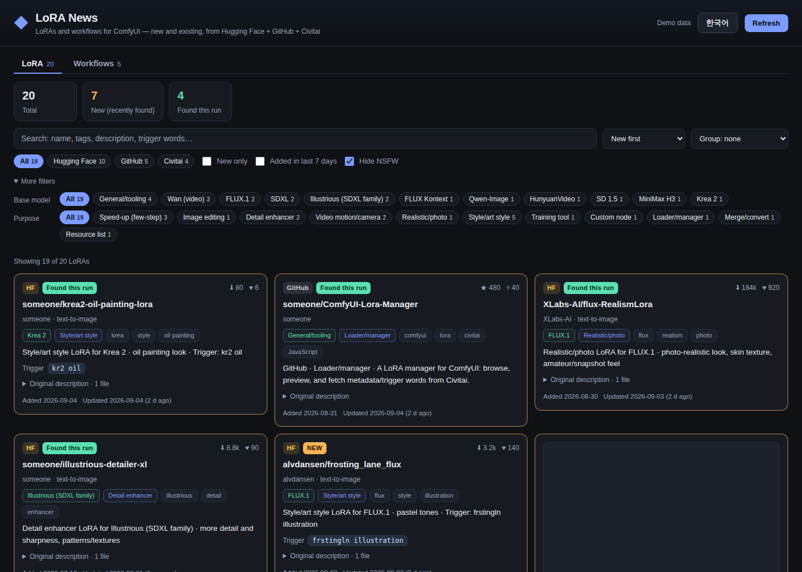
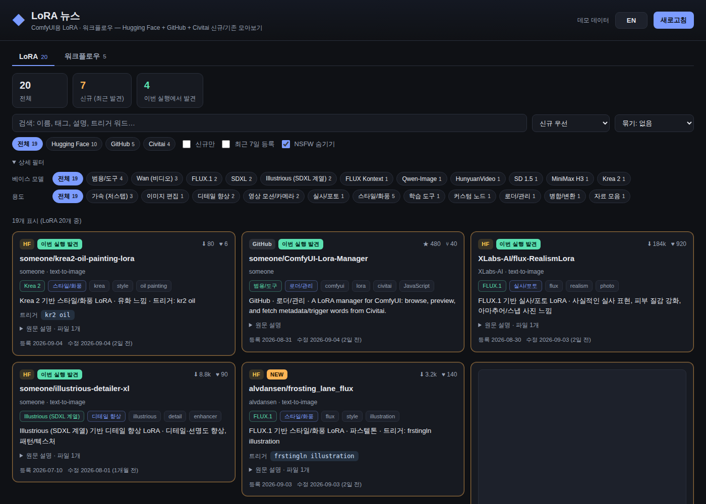
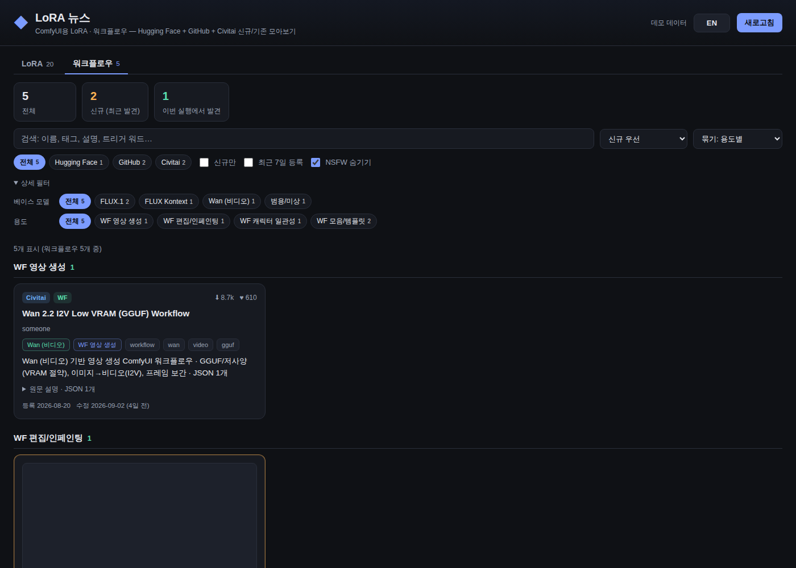
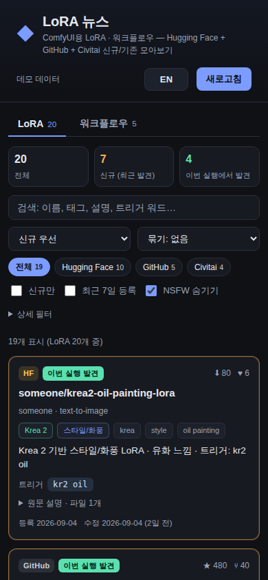

# ComfyUI LoRA News

[](https://github.com/ssain3d-lgtm/Comfyui-Lora-news/actions/workflows/tests.yml)
[](LICENSE)
[](https://www.python.org/downloads/)

[English](#english) · [한국어](#한국어)

A local web app that, every time you run it, pulls the latest **LoRAs** and **ComfyUI workflows** from
**Hugging Face**, **GitHub** and **Civitai**, flags what is **new**, sorts everything by base model
(FLUX / SDXL / Pony / Illustrious / Wan / Krea 2 / MiniMax H3 / …) and purpose (style · character · realistic · speed-up ·
image editing · video motion · training tools …), and shows a one-line summary plus trigger words for each item.
The UI switches between **English and Korean** with one click.

| English | 한국어 |
| --- | --- |
|  |  |





---

## English

### Installation (step by step)

> This is a **standalone app**, not a ComfyUI custom node. Do **not** put it in `ComfyUI/custom_nodes`.
> It runs on its own and opens a page in your browser; ComfyUI does not need to be running.

**1. Install Python 3.10 or newer** (skip if you already have it)

- Windows: download from <https://www.python.org/downloads/>, run the installer and tick **"Add python.exe to PATH"**.
- macOS: `brew install python` or the installer from python.org.
- Linux: `sudo apt install python3` (Debian/Ubuntu) or your distro's package.

Check it:

```bash
python --version      # Windows
python3 --version     # macOS / Linux
```

You should see `Python 3.10` or higher. No other packages are required.

**2. Get the code** (either way works)

```bash
git clone https://github.com/ssain3d-lgtm/Comfyui-Lora-news.git
cd Comfyui-Lora-news
```

or click **Code → Download ZIP** on GitHub, extract it, and open the extracted folder.

**3. (Optional) Configure tokens**

Everything works without tokens. If you want a higher GitHub rate limit, Civitai API access, or Claude-written summaries,
copy `.env.example` to `.env` and fill in the lines you need:

```bash
copy .env.example .env      # Windows
cp .env.example .env        # macOS / Linux
```

The app reads `.env` from its own folder on start. Variables set in your shell take precedence.
For Claude summaries also run `pip install -r requirements-optional.txt`.

**4. Run it**

```bash
# Windows: double-click run.bat, or in a terminal
run.bat

# macOS / Linux
./run.sh

# Any OS
python app.py          # use python3 on macOS / Linux
```

Your browser opens `http://127.0.0.1:8765/`. The first fetch runs in the background and takes about a minute;
the page refreshes itself when it is done. If the browser does not open, paste the address yourself.
Press `Ctrl+C` in the terminal to stop.

**5. Update later**

```bash
git pull
```

(or download the ZIP again). Your cache in `data/` and your `.env` are kept.
To uninstall, delete the folder.

### Running options

Use the **Refresh** button at any time; the **EN / 한국어** button switches the language (remembered in the browser).

| Option | Description |
| --- | --- |
| `--no-browser` | Do not open the browser |
| `--no-refresh` | Serve the cached data only |
| `--refresh-only` | Fetch, print a summary and exit (for cron / Task Scheduler) |
| `--demo` | Run with bundled sample data, no network needed |
| `--port 9000` | Change the port (default 8765) |
| `--host 0.0.0.0` | Bind address (default 127.0.0.1, local only) |
| `-v`, `--verbose` | Debug logging |
| `--version` | Print the version and exit |

`--refresh-only` exits with `0` when it has items to show and `1` when it collected nothing.

### Troubleshooting

| Symptom | What to do |
| --- | --- |
| `python` is not recognized / command not found | Reinstall Python with "Add to PATH" ticked, or use `py -3 app.py` (Windows) / `python3 app.py` (macOS, Linux) |
| `Address already in use` | Another program uses port 8765: run `python app.py --port 9000` |
| "GitHub API rate limit exceeded" in the page | Unauthenticated search allows 10 requests/min; add `GITHUB_TOKEN` to `.env` or wait a minute and press Refresh |
| "Civitai returned 403" | Cloudflare blocked the request; add `CIVITAI_API_KEY` to `.env`. The previous cache is kept meanwhile |
| Page is empty on first run | The fetch is still running (spinner at the top right); wait for it to finish |
| All three sources failed | You are offline or behind a proxy. The app keeps the previous cache; use `python app.py --demo` to check the UI |
| Thumbnails do not appear | Images load from Civitai's CDN. If it is blocked the card simply drops the image |
| Want to verify the UI without network | `python app.py --demo` |

### Features

- **Three sources**: Hugging Face (`lora`-tagged models), GitHub (repository search), Civitai (LORA / LoCon / DoRA and Workflows types)
- **LoRA / Workflows tabs**: Civitai workflows, GitHub `comfyui workflow` repositories and workflow-JSON repositories on Hugging Face are collected separately
- **New detection**: items seen for the first time get a `NEW` badge; items first seen during this run get `Found this run` (new for 72 hours by default)
- **Classification**: chips for base model and purpose; group by purpose, base model or source. Workflows use their own categories: image generation, video generation, editing/inpainting, upscale/fix, ControlNet/pose, character consistency, training/tools, collections/templates
- **Summaries**: rule-based one-liners built from the name, tags and model card, in both English and Korean, e.g. `Style/art style LoRA for FLUX.1 · pastel tones · Trigger: frstingln illustration`
- **Preview thumbnails**: Civitai items show their preview image (all-ages images only; NSFW items never get one)
- **Pick your sources**: `LORA_NEWS_SOURCES=huggingface,github` skips a source that is blocked for you
- **Trigger words**: pulled from Hugging Face model cards (`instance_prompt`, "Trigger words:") and Civitai `trainedWords`; click to copy
- **Sort / search**: new first, added, updated, downloads, likes/stars, name; text search; hide NSFW (on by default)
- **Cache**: results live in `data/`, so the last result is available even offline
- **Optional Claude summaries**: with an API key Claude writes more natural English and Korean summaries (only for new items, cached)

### Environment variables (all optional)

Set these in your shell or in the `.env` file (see `.env.example`).

| Variable | Description |
| --- | --- |
| `GITHUB_TOKEN` | Raises the GitHub search limit (unauthenticated is 10 requests/min) |
| `HF_TOKEN` | Hugging Face token (higher rate limit; private models are not collected) |
| `CIVITAI_API_KEY` | Civitai API key (try it if you get 403 / rate-limit errors) |
| `LORA_NEWS_CIVITAI_NSFW` | `1` to also fetch NSFW items from Civitai (off by default; they can still be hidden in the UI) |
| `LORA_NEWS_CIVITAI_LIMIT` | Items per Civitai query (default 100, max 100) |
| `LORA_NEWS_SOURCES` | Use only some sources, e.g. `huggingface,github` (`hf` / `gh` / `cv` also work) |
| `ANTHROPIC_API_KEY` | Enables Claude summaries; needs `pip install anthropic` |
| `LORA_NEWS_CLAUDE` | `0` disables Claude even with a key; `1` enables it with an `ant auth login` profile |
| `LORA_NEWS_CLAUDE_MODEL` | Default `claude-opus-5` |
| `LORA_NEWS_CLAUDE_MAX_ITEMS` | Max items summarised per run (default 60) |
| `LORA_NEWS_NEW_WINDOW_HOURS` | How long an item stays "new" after first sighting (default 72) |
| `LORA_NEWS_HF_LIMIT` | Items per Hugging Face query (default 100) |
| `LORA_NEWS_GH_PER_PAGE` | Items per GitHub query (default 50) |
| `LORA_NEWS_README_MAX` | Max model cards (READMEs) fetched per run (default 40) |
| `LORA_NEWS_HTTP_TIMEOUT` | Per-request timeout in seconds (default 30) |
| `LORA_NEWS_REFRESH_DEADLINE` | Give up on a source after this many seconds (default 180) |
| `LORA_NEWS_PORT` / `LORA_NEWS_HOST` | Port / bind address |
| `LORA_NEWS_DATA_DIR` | Cache folder (default `./data`) |

To turn on Claude summaries:

```bash
pip install anthropic
set ANTHROPIC_API_KEY=sk-ant-...      # Windows (PowerShell: $env:ANTHROPIC_API_KEY="...")
export ANTHROPIC_API_KEY=sk-ant-...   # macOS / Linux
python app.py
```

Summaries are cached in `data/summaries.json`, so an item is never paid for twice.
If the safety classifier declines a request, the server-side default fallback model is used automatically.

### How it works

1. Hugging Face `api/models` is queried with the `lora` tag for the text-to-image, image-to-image, text-to-video and
   image-to-video pipelines, sorted by created, downloads, likes and last modified (100 per query), and the results are merged.
2. GitHub `search/repositories` is queried for `comfyui lora`, `topic:lora topic:comfyui`, `lora flux/training`,
   `comfyui workflow` and `topic:comfyui-workflow` (8 queries, under the unauthenticated limit).
3. Civitai `api/v1/models` is queried with `types=LORA,LoCon,DoRA` and `types=Workflows`, newest / weekly and monthly
   downloads / highest rated, with `nsfw=false` by default. `baseModel` and `trainedWords` are used directly.
4. Workflows are Civitai Workflows, GitHub repositories with "workflow" in the name or topics, and Hugging Face
   model/dataset repositories named comfy+workflow.
5. Each item's name, tags, `base_model` tag and model-card excerpt are run through keyword rules to get the base model,
   purpose, hints and trigger words, then English and Korean one-liners are built.
6. `data/seen.json` records when each item was first seen. The first run is a baseline: only items whose source
   creation date is recent are marked new. From the next run on, newly appearing items get `Found this run`.
7. Optionally Claude writes summaries for new / unsummarised items and caches them.

### Limitations

- Hugging Face models without the `lora` tag are not picked up.
- Civitai sits behind Cloudflare and may return 403 in some environments. Try `CIVITAI_API_KEY`; on failure the previous cache is kept.
- Workflows are detected by repository name/type, so GitHub / Hugging Face repositories without "workflow" in the name can be missed.
- The keyword rules fall back to `Other` / `Unknown` for unhelpful names; Claude summaries also fix the category.
- GitHub's unauthenticated search limit (10/min) can trip; that run then keeps the previous cache.

### Tests

```bash
python -m unittest discover -s tests -v
```

### Layout

```
app.py                  # server + CLI entry point
lora_news/
  config.py             # environment settings
  models.py             # LoraItem data model
  http.py               # urllib-based HTTP helper
  i18n.py               # English/Korean backend messages
  text.py               # HTML stripping and text clean-up
  sources/huggingface.py# HF collection (LoRA models + workflow models/datasets) + README excerpts
  sources/github.py     # GitHub search (LoRA tools + workflow repositories)
  sources/civitai.py    # Civitai collection (LoRA + Workflows)
  classify.py           # base model / purpose / hints / trigger words / EN+KO rule summaries
  summarize.py          # optional Claude summaries
  store.py              # JSON storage in data/
  service.py            # fetch -> classify -> new detection -> summarise -> save
static/                 # front-end (no dependencies, EN/KO toggle)
tests/                  # unit tests + sample data
docs/                   # screenshots
.env.example            # optional settings template (copy to .env)
.github/workflows/      # CI: unit tests on Python 3.10-3.13
LICENSE                 # MIT
```

### License

MIT. See [LICENSE](LICENSE).

---

## 한국어

실행할 때마다 **Hugging Face**, **GitHub**, **Civitai**에서 LoRA와 ComfyUI 워크플로우의 최신 목록을 받아와,
**신규 항목**과 **기존 항목**을 베이스 모델(FLUX / SDXL / Pony / Illustrious / Wan / Krea 2 / MiniMax H3 / …)과
용도(스타일 · 캐릭터 · 실사 · 가속 · 이미지 편집 · 영상 모션 · 학습 도구 …)별로 나누고,
각 항목에 **한 줄 요약**과 **트리거 워드**를 붙여 브라우저에서 보여주는 로컬 웹앱입니다.
화면 상단의 **EN / 한국어** 버튼으로 영문·한글 표시를 전환하고, **LoRA / 워크플로우** 탭으로 종류를 전환합니다.

### 설치 방법 (단계별)

> 이 프로그램은 **ComfyUI 커스텀 노드가 아니라 별도로 실행하는 앱**입니다. `ComfyUI/custom_nodes` 에 넣지 마세요.
> 혼자 실행되어 브라우저에 페이지를 띄우며, ComfyUI 가 켜져 있을 필요도 없습니다.

**1. Python 3.10 이상 설치** (이미 있으면 건너뜀)

- Windows: <https://www.python.org/downloads/> 에서 설치 파일을 받아 실행하고, **"Add python.exe to PATH"** 에 체크합니다.
- macOS: `brew install python` 또는 python.org 설치 파일.
- Linux: `sudo apt install python3` (Debian/Ubuntu) 등 배포판 패키지.

확인:

```bash
python --version      # Windows
python3 --version     # macOS / Linux
```

`Python 3.10` 이상이 나오면 됩니다. 다른 패키지는 필요 없습니다.

**2. 코드 받기** (둘 중 하나)

```bash
git clone https://github.com/ssain3d-lgtm/Comfyui-Lora-news.git
cd Comfyui-Lora-news
```

또는 GitHub 에서 **Code → Download ZIP** 을 눌러 압축을 풀고 그 폴더로 들어갑니다.

**3. (선택) 토큰 설정**

토큰 없이도 동작합니다. GitHub 한도 확대, Civitai API, Claude 요약을 쓰고 싶을 때만
`.env.example` 을 `.env` 로 복사해 필요한 줄을 채우세요:

```bash
copy .env.example .env      # Windows
cp .env.example .env        # macOS / Linux
```

앱은 시작할 때 자기 폴더의 `.env` 를 읽습니다. 쉘에 설정된 환경변수가 우선합니다.
Claude 요약을 쓰려면 `pip install -r requirements-optional.txt` 도 실행합니다.

**4. 실행**

```bash
# Windows: run.bat 더블클릭, 또는 터미널에서
run.bat

# macOS / Linux
./run.sh

# 공통
python app.py          # macOS / Linux 는 python3
```

브라우저가 `http://127.0.0.1:8765/` 를 엽니다. 첫 수집은 백그라운드에서 1분 정도 걸리고 끝나면 화면이 자동 갱신됩니다.
브라우저가 안 열리면 주소를 직접 입력하세요. 종료는 터미널에서 `Ctrl+C`.

**5. 업데이트**

```bash
git pull
```

(또는 ZIP 을 다시 받기). `data/` 캐시와 `.env` 는 그대로 유지됩니다. 삭제는 폴더를 지우면 끝입니다.

### 실행 옵션

오른쪽 위 **새로고침** 버튼으로 언제든 다시 받아올 수 있고, **EN / 한국어** 버튼으로 언어를 바꿉니다(브라우저에 기억됨).

| 옵션 | 설명 |
| --- | --- |
| `--no-browser` | 브라우저 자동 열기 안 함 |
| `--no-refresh` | 시작 시 수집하지 않고 캐시만 표시 |
| `--refresh-only` | 서버 없이 수집만 하고 종료 (작업 스케줄러/cron 용) |
| `--demo` | 네트워크 없이 샘플 데이터로 UI 확인 |
| `--port 9000` | 포트 변경 (기본 8765) |
| `--host 0.0.0.0` | 바인드 주소 (기본 127.0.0.1, 로컬 전용) |
| `-v`, `--verbose` | 상세 로그 |
| `--version` | 버전 출력 후 종료 |

`--refresh-only` 는 보여줄 항목이 있으면 `0`, 하나도 못 모으면 `1` 로 끝납니다.

### 문제 해결

| 증상 | 조치 |
| --- | --- |
| `python` 을 찾을 수 없음 | "Add to PATH" 체크 후 Python 재설치, 또는 `py -3 app.py` (Windows) / `python3 app.py` (macOS, Linux) |
| `Address already in use` | 8765 포트를 다른 프로그램이 사용 중: `python app.py --port 9000` |
| 화면에 "GitHub API 요청 한도 초과" | 비로그인 검색은 분당 10회: `.env` 에 `GITHUB_TOKEN` 추가하거나 1분 뒤 새로고침 |
| "Civitai 접근 거부(403)" | Cloudflare 차단: `.env` 에 `CIVITAI_API_KEY` 추가. 그동안은 이전 캐시 유지 |
| 첫 실행에 화면이 비어 있음 | 수집이 진행 중(오른쪽 위 회전 표시). 끝날 때까지 기다리면 됨 |
| 세 소스가 모두 실패 | 오프라인이거나 프록시에 막힌 상태입니다. 이전 캐시를 유지하며, `python app.py --demo` 로 화면만 확인할 수 있습니다 |
| 썸네일이 안 보임 | 이미지는 Civitai CDN 에서 불러옵니다. 막혀 있으면 카드에서 이미지만 빠집니다 |
| 네트워크 없이 화면만 확인 | `python app.py --demo` |

### 기능

- **세 가지 소스**: Hugging Face(`lora` 태그 모델), GitHub(저장소 검색), Civitai(LORA/LoCon/DoRA + Workflows 타입)
- **LoRA / 워크플로우 탭**: Civitai 워크플로우, GitHub `comfyui workflow` 저장소, HF에 올라온 워크플로우 JSON 모음을 따로 모아 봄
- **신규 감지**: 처음 발견한 항목은 `NEW`, 이번 실행에서 처음 본 항목은 `이번 실행 발견` 배지 (기본 72시간 동안 신규로 표시)
- **분류**: 베이스 모델 / 용도별 칩 필터, 용도별·베이스 모델별·소스별 묶어보기.
  워크플로우는 이미지 생성 · 영상 생성 · 편집/인페인팅 · 업스케일/보정 · 컨트롤넷/포즈 · 캐릭터 일관성 · 학습/도구 · 모음/템플릿으로 분류
- **한/영 요약**: 이름·태그·모델 카드에서 규칙으로 뽑은 요약을 두 언어로 생성 (예: `FLUX.1 기반 스타일/화풍 LoRA · 파스텔톤 · 트리거: xyz`)
- **미리보기 썸네일**: Civitai 항목은 미리보기 이미지를 함께 보여줍니다 (전체 이용가 이미지만, NSFW 항목은 표시하지 않음)
- **소스 선택**: `LORA_NEWS_SOURCES=huggingface,github` 로 막혀 있는 소스를 건너뛸 수 있습니다
- **트리거 워드**: HF 모델 카드의 `instance_prompt` / "Trigger words:" 문구, Civitai의 `trainedWords` 자동 추출, 클릭하면 복사
- **정렬/검색**: 신규 우선, 등록일, 수정일, 다운로드, 좋아요/스타, 이름 · 텍스트 검색 · NSFW 숨기기(기본)
- **캐시**: 결과는 `data/` 폴더에 저장되어 네트워크가 안 되어도 마지막 결과를 볼 수 있음
- **(선택) Claude 요약**: API 키가 있으면 더 자연스러운 영문·한글 요약을 생성 (신규 항목만 호출, 캐시됨)

### 환경변수 (모두 선택)

쉘 환경변수 또는 `.env` 파일(`.env.example` 참고)로 설정합니다.

| 변수 | 설명 |
| --- | --- |
| `GITHUB_TOKEN` | GitHub 검색 API 한도 확대 (비로그인은 분당 10회) |
| `HF_TOKEN` | Hugging Face 토큰 (한도 확대, 비공개 모델은 대상 아님) |
| `CIVITAI_API_KEY` | Civitai API 키 (403/한도 오류가 나면 설정해 보세요) |
| `LORA_NEWS_CIVITAI_NSFW` | `1` 이면 Civitai에서 NSFW 항목도 받아옴 (기본은 제외, 받아온 뒤에도 화면에서 숨기기 가능) |
| `LORA_NEWS_CIVITAI_LIMIT` | Civitai 쿼리당 개수 (기본 100, 최대 100) |
| `LORA_NEWS_SOURCES` | 일부 소스만 사용, 예: `huggingface,github` (`hf` / `gh` / `cv` 도 인식) |
| `ANTHROPIC_API_KEY` | 설정하면 Claude로 요약 생성. `pip install anthropic` 필요 |
| `LORA_NEWS_CLAUDE` | `0` 으로 두면 키가 있어도 Claude 요약 끔, `1` 이면 `ant auth login` 프로필로도 사용 |
| `LORA_NEWS_CLAUDE_MODEL` | 기본 `claude-opus-5` |
| `LORA_NEWS_CLAUDE_MAX_ITEMS` | 한 번 실행에 요약할 최대 개수 (기본 60) |
| `LORA_NEWS_NEW_WINDOW_HOURS` | 처음 발견 후 신규로 표시할 시간 (기본 72) |
| `LORA_NEWS_HF_LIMIT` | Hugging Face 쿼리당 개수 (기본 100) |
| `LORA_NEWS_GH_PER_PAGE` | GitHub 쿼리당 개수 (기본 50) |
| `LORA_NEWS_README_MAX` | 모델 카드(README)를 읽어올 최대 개수 (기본 40) |
| `LORA_NEWS_HTTP_TIMEOUT` | 요청 하나의 제한 시간(초, 기본 30) |
| `LORA_NEWS_REFRESH_DEADLINE` | 한 소스를 이 시간(초)까지만 기다림 (기본 180) |
| `LORA_NEWS_PORT` / `LORA_NEWS_HOST` | 포트 / 바인드 주소 |
| `LORA_NEWS_DATA_DIR` | 캐시 폴더 (기본 `./data`) |

Claude 요약을 켜려면:

```bash
pip install anthropic
set ANTHROPIC_API_KEY=sk-ant-...      # Windows (PowerShell 은 $env:ANTHROPIC_API_KEY="...")
export ANTHROPIC_API_KEY=sk-ant-...   # macOS / Linux
python app.py
```

요약은 `data/summaries.json` 에 캐시되므로 같은 항목에 대해 다시 비용이 들지 않습니다.
안전 분류기가 요청을 거절하면 서버 쪽 기본 폴백 모델로 자동 재시도하도록 설정되어 있습니다.

### 동작 원리

1. Hugging Face `api/models` 를 `lora` 태그 + text-to-image / image-to-image / text-to-video / image-to-video 파이프라인으로
   등록순·다운로드순·수정순 등 여러 각도에서 조회해 합칩니다 (쿼리당 100개).
2. GitHub `search/repositories` 로 `comfyui lora`, `topic:lora topic:comfyui`, `lora flux/training`, `comfyui workflow`,
   `topic:comfyui-workflow` 를 검색합니다 (비로그인 한도 안에 들도록 8개 쿼리).
3. Civitai `api/v1/models` 를 `types=LORA,LoCon,DoRA` 와 `types=Workflows` 로 최신순·주간/월간 다운로드순·평점순 조회합니다.
   기본은 `nsfw=false` 로 받아오며, 베이스 모델(`baseModel`)과 트리거 워드(`trainedWords`)를 그대로 사용합니다.
4. 워크플로우는 Civitai Workflows 타입, 이름/토픽에 workflow 가 들어간 GitHub 저장소, 이름에 comfy+workflow 가 들어간 HF 모델/데이터셋을 모읍니다.
5. 항목마다 이름·태그·`base_model` 태그·모델 카드 발췌를 규칙으로 분석해 베이스 모델, 용도, 힌트, 트리거 워드를 뽑고 영문·한글 요약을 만듭니다.
6. `data/seen.json` 에 "처음 본 시각"을 기록해 신규 여부를 판정합니다. 첫 실행은 기준선으로 삼아
   소스의 등록일이 최근인 것만 신규로 표시하고, 이후 실행부터 새로 나타난 항목을 `이번 실행 발견` 으로 표시합니다.
7. (선택) Claude 가 신규·미요약 항목의 요약을 작성하고 캐시합니다.

### 한계

- Hugging Face 의 `lora` 태그가 없는 모델은 잡히지 않습니다.
- Civitai 는 Cloudflare 보호 때문에 환경에 따라 403 이 날 수 있습니다. 그 경우 `CIVITAI_API_KEY` 를 설정해 보고, 실패하면 이전 캐시를 유지합니다.
- 워크플로우는 저장소 이름/타입으로 판별하므로 이름에 workflow 가 없는 GitHub/HF 저장소는 놓칠 수 있습니다.
- 규칙 기반 분류는 이름/태그가 불친절하면 `기타`/`미상` 으로 빠질 수 있습니다. Claude 요약을 켜면 분류도 함께 보정됩니다.
- GitHub 비로그인 검색 한도(분당 10회)에 걸리면 해당 실행에서는 이전 캐시를 유지합니다.

### 테스트

```bash
python -m unittest discover -s tests -v
```

### 구조

```
app.py                  # 서버 + CLI 진입점
lora_news/
  config.py             # 환경변수 설정
  models.py             # LoraItem 데이터 모델
  http.py               # urllib 기반 HTTP 도우미
  i18n.py               # 백엔드 메시지 한/영 문구
  text.py               # HTML 제거 등 텍스트 정리
  sources/huggingface.py# HF 수집 (LoRA 모델 + 워크플로우 모델/데이터셋) + README 발췌
  sources/github.py     # GitHub 검색 수집 (LoRA 도구 + 워크플로우 저장소)
  sources/civitai.py    # Civitai 수집 (LoRA + Workflows)
  classify.py           # 베이스 모델/용도/힌트/트리거/영문·한글 규칙 요약
  summarize.py          # (선택) Claude 요약
  store.py              # data/ JSON 저장
  service.py            # 수집→분류→신규 판정→요약→저장
static/                 # 프론트엔드 (의존성 없음, 한/영 토글)
tests/                  # 단위 테스트 + 샘플 데이터
docs/                   # 스크린샷
.env.example            # 선택 설정 템플릿 (.env 로 복사해서 사용)
.github/workflows/      # CI: Python 3.10~3.13 에서 단위 테스트
LICENSE                 # MIT
```

### 라이선스

MIT 입니다. [LICENSE](LICENSE) 를 참고하세요.
